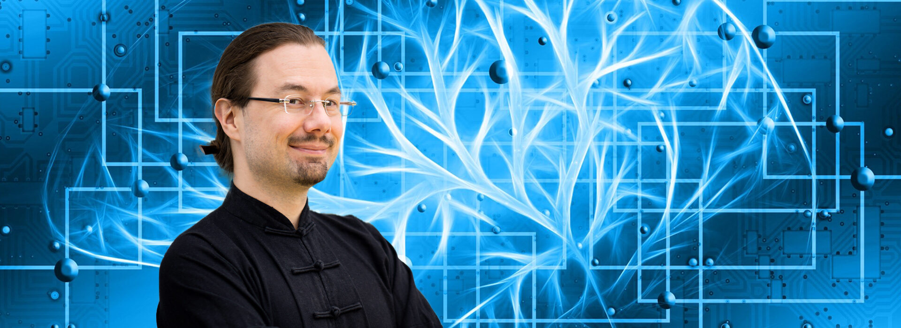

# Dr. Tristan Behrens

**AI Guru | Deep Learning Expert | Educator**

Born June 16, 1981 | Based in Würzburg, Germany

## About

I'm an AI hands-on advisor specializing in Machine Learning and Deep Learning. Since January 2018, I've been working as a freelance teacher, consultant, developer, trainer, and mentor, helping organizations and individuals unlock the potential of artificial intelligence.

## Education

**PhD in Natural Sciences (Dr. rer. nat.)** - *Magna cum Laude*
Technical University of Clausthal (2006-2012)
Dissertation: "Towards Building Blocks for Agent-Oriented Programming"
Supervisor: Prof. Dr. Jürgen Dix
Focus on Artificial Intelligence and Multi-Agent Systems (since 2004)

**Diploma in Computer Science (Dipl.-Inf.)** - *Sehr gut*
Technical University of Clausthal (2001-2006)
Thesis: "Static Analysis of C# Programs"
First AI lecture attended in 2004

## Professional Experience

### AI Consultant | Xeptum (July 2024 - November 2024)
- Generative AI for automatic content generation
- Teaching and upskilling teams
- Agentic workflows and agents
- AI integration and implementation

### AI Consultant | Schneider Electric (September 2024 - Present)
- Teaching and upskilling teams in AI technologies
- Generative AI in software development
- Agentic workflows and agents
- Technology consulting and implementation

### AI Expert | Bildungscampus (April 2024 - Present)
- MLOps implementation and best practices
- Model Context Protocol (MCP)
- Internal upskilling programs
- Agentic workflows and agents
- Technology scouting
- Deep learning for speech impediments

### AI Music Artist in Residence | KI Salon Heilbronn (2023 - March 2024)
- Created and exhibited "Neuro Kybernetik Bach" AI music installation
- Community engagement and AI education
- Leveraging NVIDIA RTX 4090 infrastructure for AI music generation
- Making AI more accessible and tangible through art

### Co-Founder | Stealth-Mode Startup (2020 - 2021)
- Developing AI-based music generation platform enabling high-quality music composition
- Data Science and Machine Learning for music corpus analysis
- Training neural networks (CNNs and RNNs) for polyphonic composition
- Integration of rule-based systems for optimal UX

### Deep Learning Expert | Child Growth Monitor (2018 - 2019)
Deutsche Welthungerhilfe
- Advancing Data Science and Deep Learning for image processing
- Mentoring and coaching development team
- Implementing CNNs, Graph NNs, and Transformers for 3D point cloud analysis
- Project: [childgrowthmonitor.org](https://childgrowthmonitor.org)

### AI Guru | Freelance (2018 - Present)
- Teaching and consulting on modern Machine Learning methods
- Deep Learning and Data Science training for companies
- AI product development as sparring partner
- Knowledge acquisition and transfer

### Topic Owner Deep Learning | Porsche Digital Lab Berlin (2016-2017)
- Founding member of the lab
- Introducing agile methods and maintaining knowledge base
- Leading creative workshops and MVP development sprints
- Technology scouting in startup ecosystem
- Rapid prototyping and knowledge transfer

### Senior Consultant | MHP - A Porsche Company (2014-2017)
- Mobile technologies and Data Science
- Middleware development and legacy system integration
- Architect, teacher and mentor for Java-based web development, CI, and cloud-ready microservices

### IT Consultant | Volkswagen AG - InnovationLab AppFactory (2012-2014)
- iOS, Windows 8, web technologies, and Java Enterprise
- Business applications, gamification, and connected car solutions
- 2D and 3D visualizations

### Research Associate & PhD Candidate | TU Clausthal (2006-2012)
- Research, teaching, and development
- Simulations in Artificial Intelligence
- Focus on Multi-Agent Systems
- Multi-Agent Programming Contest organizer and developer

### Game Developer | Part-time (2010-2013)

## Expertise

**Core Competencies:**
- Practical knowledge transfer of complex topics
- Research & Development (academia, industry, and intersection)
- Software development (programming since the 1990s, current focus: Python)
- Building study programs
- International expert collaboration

**Technical Skills:**
- Artificial Intelligence, Machine Learning, Deep Learning
- Data Science (theory and practice)
- Computer Vision (2D and 3D)
- Natural Language Processing
- Time Series Analysis
- Reinforcement Learning
- Transfer Learning and Representation Learning
- Digital Signal Processing (audio/music)

**Methodologies:**
- Agile Methods
- Leader Effectiveness
- Getting Things Done
- Management and Self-Management

## Teaching & Training

Regular instructor for companies and institutions on:
- Deep Learning fundamentals and advanced topics
- Machine Learning best practices
- Data Science workflows
- Neural network architectures (CNNs, RNNs, Transformers)
- Practical hands-on coding sessions

**Selected Clients:** Daimler AG, Mercedes Benz Consulting, Data Science Retreat, SPICED Academy, ThoughtWorks, Paessler AG, and more.

## Community

**Deep Learning in Würzburg Meetup**
Organizer of regular meetups promoting AI knowledge in the Mainfranken region.

## Publications

Author and co-author of numerous scientific publications on:
- Multi-Agent Systems
- Agent-Oriented Programming
- Environment Interface Standards
- Multi-Agent Programming Contest
- Sound-based analysis and predictive maintenance

[Google Scholar Profile](https://scholar.google.com/citations?user=4a6fJ4wAAAAJ)

## Contact

- **Email:** tristan@ai-guru.de
- **Website:** [ai-guru.de](http://ai-guru.de)
- **Blog:** [ai-guru.de/blog](http://ai-guru.de/blog)
- **GitHub:** [@AI-Guru](https://github.com/AI-Guru)
- **LinkedIn:** [Tristan Behrens](https://www.linkedin.com/in/tristan-behrens-734967a2/)
- **XING:** [Profile](https://www.xing.com/profiles/Tristan_Behrens)

## Philosophy

I'm a **T-shaped person** - combining broad expertise across multiple domains with deep knowledge in specific areas. As a **scanner personality**, I thrive on acquiring knowledge and sharing it with others. I'm passionate about helping people develop their abilities and interests, and I apply the same dedication to my own continuous growth.

My approach: **Practice first, theory follows.** I believe experimentation is the most efficient way to create and transfer knowledge - "Learning by doing" scales beautifully, even with larger groups.
